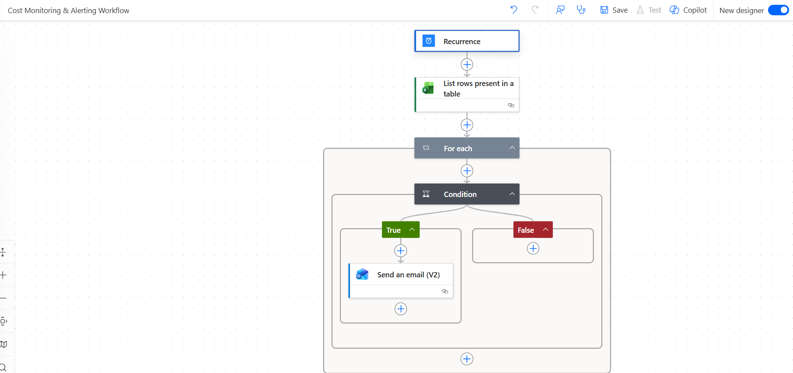
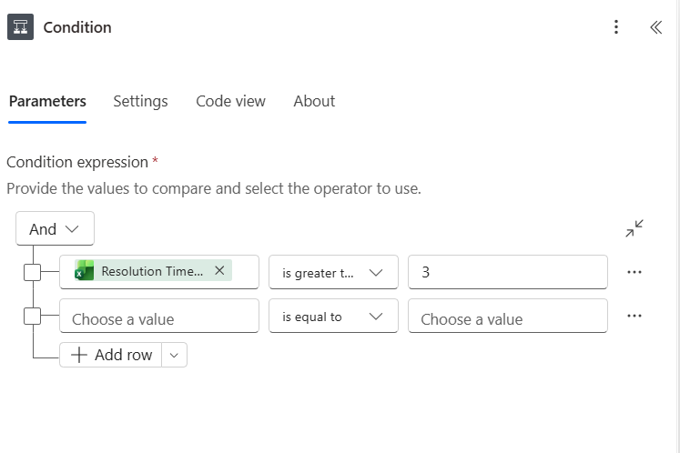
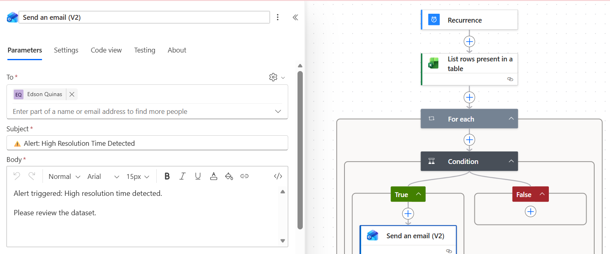

# 🚨 Project: Cost Monitoring & Alerting Workflow

## 🎯 Objective
Design and implement a monitoring workflow that automatically detects anomalies in operational data and triggers alerts when defined thresholds are exceeded.

---

## 🧩 Workflow Overview

---

## 🛠️ Architecture & Execution

• Created a scheduled workflow using Power Automate:
  - Recurrence trigger configured to run daily  

• Connected to structured data source:
  - Excel dataset stored in OneDrive  
  - Used "List rows present in a table" to retrieve data  

• Implemented monitoring logic:
  - Iterated through records using an "Apply to each" loop  
  - Evaluated conditions based on defined thresholds  

• Built alerting mechanism:
  - Triggered alerts when resolution time exceeded expected limits  
  - Sent automated email notifications for flagged records  

• Ensured correct execution:
  - Tested workflow with multiple scenarios  
  - Verified alerts were triggered only when conditions were met  

---

## 📸 Proof of Execution

### ✅ Workflow Overview

---

### ✅ Condition Logic

---

### ✅ Alert Notification (Email Output)

---

## 📊 Business Impact

• Enables proactive detection of issues before escalation  
• Reduces reliance on manual monitoring  
• Improves response time to operational inefficiencies  
• Provides a scalable alerting framework for automation  

---

## ✅ Key Takeaways

• Demonstrated ability to build monitoring and alerting systems  
• Applied conditional logic to detect anomalies in data  
• Integrated automation with real-time alerting workflows  
• Designed a reusable pattern for proactive system monitoring  
