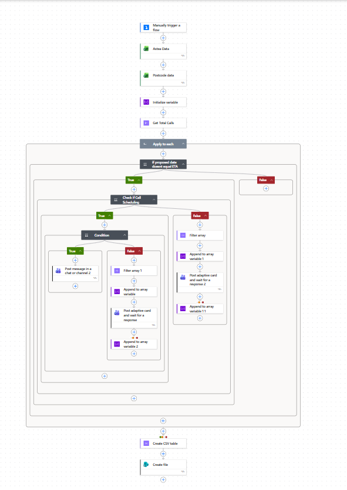
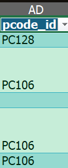
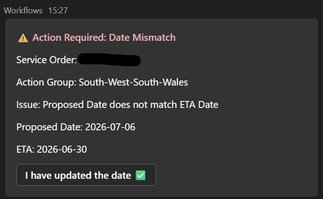

⚙️ Project: Automated Data Routing & Exception Handling

## 🎯 Objective
Automate the cross-referencing of service orders against a master regional dataset, featuring advanced exception handling to manage missing data, route exceptions dynamically, and ensure absolute workflow reliability.

---

## 🧩 Workflow Overview

---

## 🛠️ Architecture & Execution

• Connected and mapped distinct datasets across Excel environments:
  - Live and Test environments for Astea Service Order reports
  - Live and Test environments for Master Postcode routing data

• Built conditional routing logic in Power Automate:
  - Standard service orders dynamically matched by regional Action Group
  - Exception groups (e.g., "Call Scheduling") isolated and routed through custom logic

• Implemented advanced string manipulation and data processing:
  - Utilised expressions (`replace`) to strip text prefixes and isolate integer IDs on the fly (e.g., extracting "106" from "PC106")
  - Filtered master arrays dynamically based on isolated IDs

• Engineered robust failsafes and error handling:
  - Built conditional checks to intercept empty data cells (null values) before processing
  - Routed missing reference data (ghost IDs) to an admin alert email to prevent workflow crashes

---

## 📸 Proof of Execution

### ✅ Final Workflow Architecture

---

### ✅ Reference Data Structure

---

### ✅ Exception Handling & Safety Net (Admin Alert)

---

### ✅ Successful Automated Run

---

## 📊 Business Impact

• Eliminates manual cross-referencing between disjointed system reports  
• Ensures 100% workflow uptime by gracefully intercepting and routing bad or missing data  
• Improves SLA response times by instantly notifying the correct regional contacts  
• Provides an automated audit trail of missing data points to highlight where database cleanup is required
