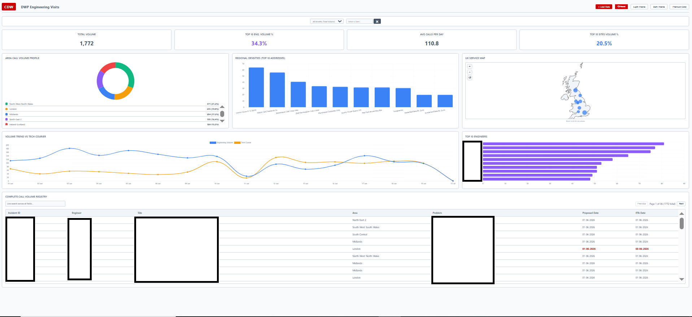
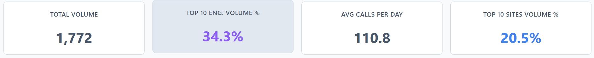
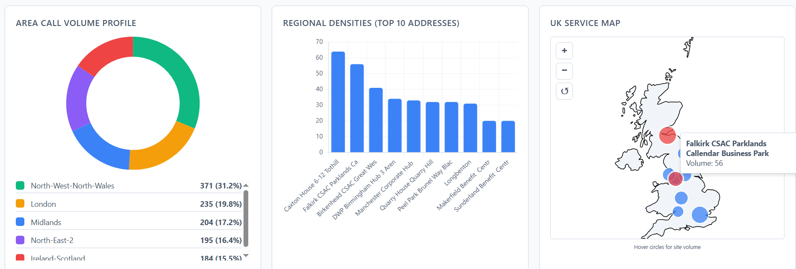
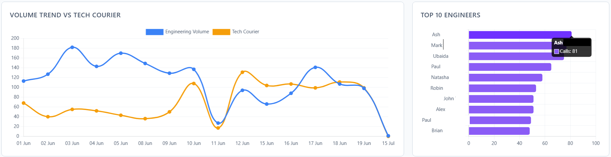
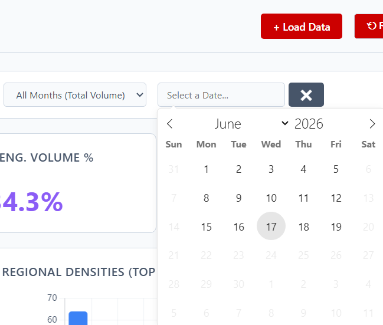
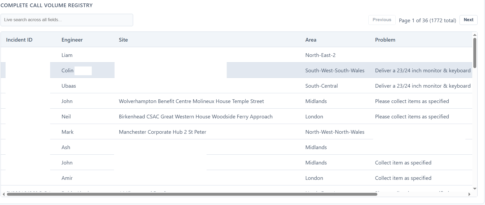

⚙️ Project: Engineering Visits Serverless Visualization Dashboard

## 🎯 Objective
Design and engineer a "zero-compute-cost" operational dashboard to visualize live engineering SLA volumes, geographical ticket distributions, and Tech Courier dependencies. The solution required a purely client-side architecture to process large datasets without incurring backend hosting or database infrastructure costs.

---

### 🧩 Dashboard Overview
(Note: Sensitive PII, Request IDs, and specific problem codes have been redacted to ensure strict BPSS compliance.)

### 🛠️ Architecture & Execution
Data Ingestion & Storage (Client-Side)

PapaParse: Implemented to parse raw CSV exports natively within the browser, utilizing strict try...catch loops to safely bypass corrupted text strings and malformed dates.

IndexedDB (LocalForage): Replaced standard browser local storage with IndexedDB to handle large datasets seamlessly, bypassing the strict 5MB browser storage quota and allowing asynchronous data loading.

Smart Merge Deduplication: Designed a custom data reconciliation algorithm using JavaScript Map objects. It dynamically identifies duplicate Request IDs (or generates ghost IDs using Date/Engineer/Site) and intelligently merges them to prevent reporting duplication.

Interactive Filtering & Visualizations

Dynamic Date Filtering: Integrated Flatpickr to scan the aggregated dataset and dynamically block out (disable) dates with no available data, ensuring users can only query valid operational windows.

Chart.js: Built modular, theme-responsive visualizations including Doughnut charts (Area Profiles), Stacked Horizontal Bars (Engineer Load), and Contextual Trend Lines.

D3.js & TopoJSON: Engineered an interactive UK geographical density map utilizing d3.geoMercator() projections to dynamically render SVG volume nodes based on specific coordinates.

📸 Proof of Execution
### ✅ KPI Metrics & Volume Tracking

Interactive KPI cards displaying Total Volume, Top 10 Engineer %, Average Daily Calls, and Top 10 Sites %. Designed with CSS hover transitions for dynamic UI response.
 
### ✅ Geographical Density & Area Profiling

D3.js UK topology map with custom hover states raising specific volume nodes to the front of the Z-index. Rendered alongside Top 10 Address bar charts and Area Doughnut charts.

### ✅ Volume Trend vs. Tech Courier Analysis

Contextual line chart isolating internal Engineering Volume against external Tech Courier usage. Includes Top 10 Engineers profiling (engineer names actively redacted for security compliance).

### ✅ Dynamic Date Filtering

Flatpickr implementation mapping specifically to ingested dataset dates, automatically restricting selection to valid operational days.

### ✅ Complete Call Volume Registry

Paginated, live-searchable registry table. Automatically excludes Tech Courier metrics to preserve internal engineering math accuracy (PII and internal Request IDs redacted).

📊 Business Impact
Zero Infrastructure Cost: Delivers enterprise-grade reporting and data visualization with a $0 cloud footprint.

Preventative Data Accuracy: The Smart Merge deduplication algorithm eliminates legacy double-counting errors natively.

Operational Visibility: Instantly highlights internal engineering workload spikes versus the reliance on external Tech Couriers.

Rapid Deployment: Can be executed instantly in any modern browser without requiring database spin-ups, API configurations, or software installations.

✅ Key Takeaways
Demonstrated advanced ability to utilize browser-native storage (IndexedDB) for complex data engineering.

Applied advanced data structures (Maps, Sets) to process, clean, and reconcile unformatted reporting data.

Engineered complex D3.js and Chart.js DOM manipulations tied to a unified, responsive CSS variable theme structure.

Displayed strict adherence to data security standards by architecting local-only execution and maintaining BPSS compliance guidelines.
