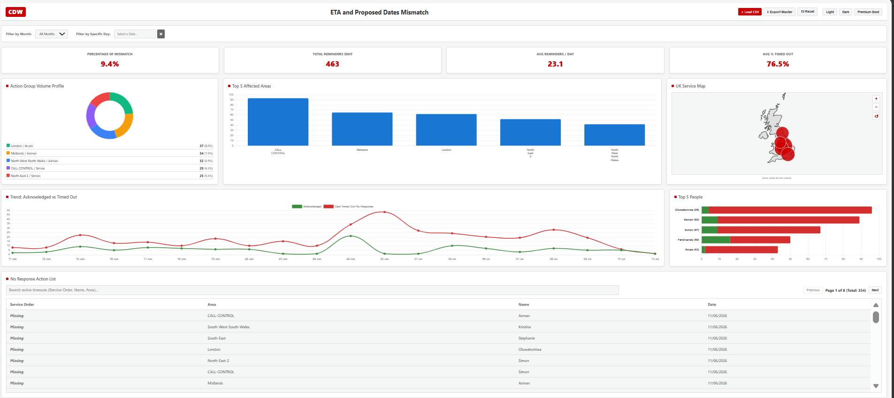
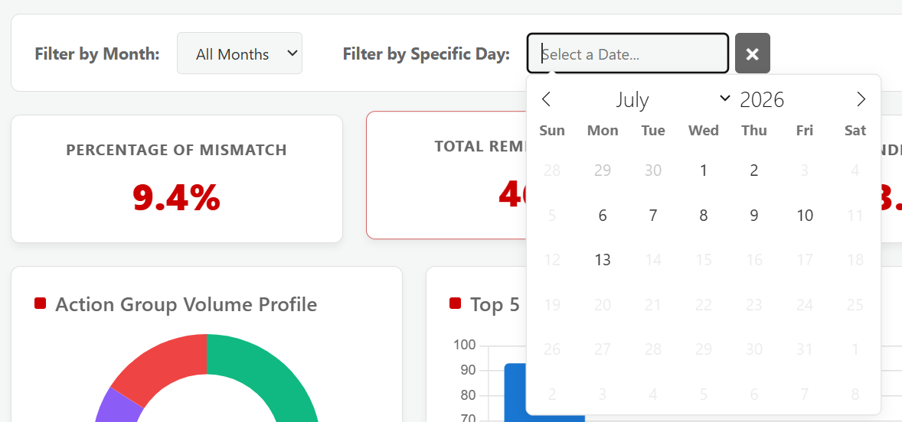
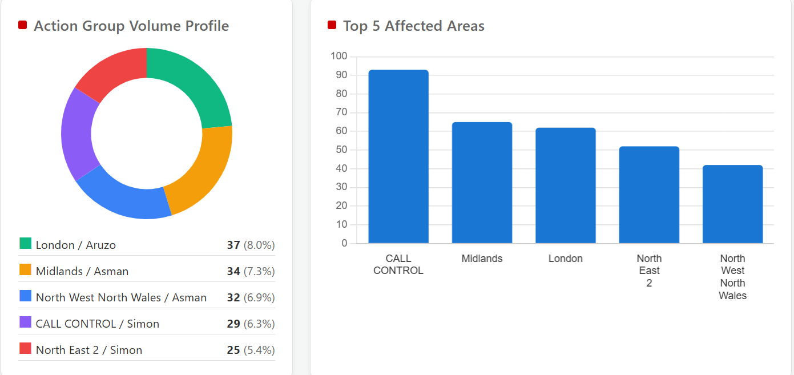
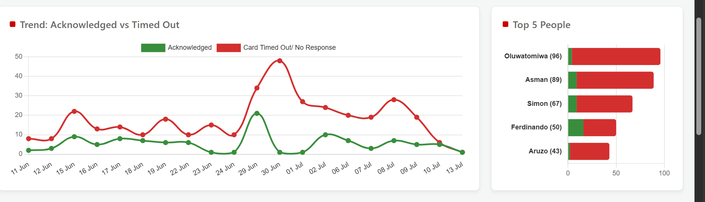
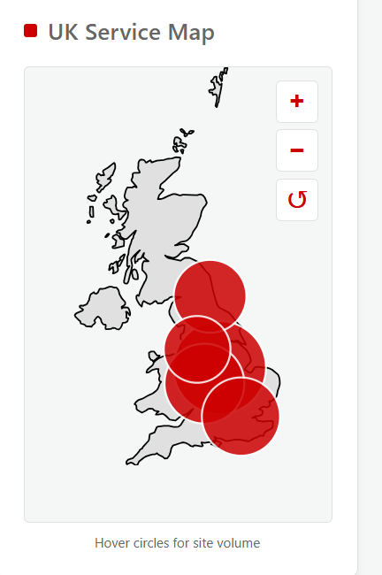
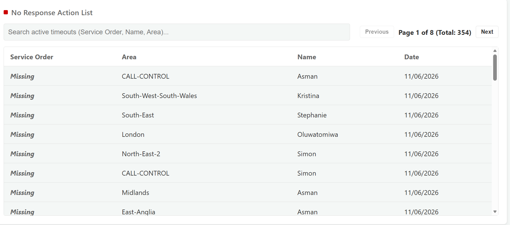

⚙️ Project: ETA Mismatch Tracker

--- 
## 🎯 Objective
To identify, monitor, and resolve discrepancies between forecasted Estimated Times of Arrival (ETA) and actual system timestamps. This solution provides immediate visibility into timing variances, ensuring stakeholder alignment and preventing cascading delays in downstream operations.

---
## 🧩 Dashboard Overview 
A lightweight, responsive HTML-based interface designed for quick diagnostic views. The dashboard highlights critical ETA mismatches using visual indicators (e.g., color-coded variance thresholds) and allows users to filter discrepancies by severity, date, or specific categories. It transforms raw timestamp data into an easily readable format for operational review.

---
## ⚒️ Arquitecture and Execution

• Frontend Interface: 
  - Built utilizing HTML, CSS, and lightweight JavaScript to ensure a fast, responsive user experience without heavy framework dependencies.

• Data Ingestion: 
  - Automatically parses and standardizes incoming timestamp data to compare expected ETAs against actual logged times.

• Logic & Processing:
  - Implements conditional formatting rules to calculate the time delta. Mismatches exceeding the acceptable tolerance threshold are flagged and pushed to the forefront of the dashboard.

• Deployment: 
  - Packaged as a standalone portfolio asset, demonstrating front-end structuring and data visualization principles.

---
## 📷 Proof of Execution

### ✅ Dashboard Overview

---

### ✅ KPI Cards

Interactive KPI cards displaying % of mismatches, Total reminders, Average daily reminders, and Average of reminders that have been timed out.
Designed with CSS hover transitions for dynamic UI response.

---

### ✅ Calendar

Flatpickr implementation mapping specifically to ingested dataset dates, automatically restricting selection to valid operational days.

---

### ✅ Charts

Pie chart displaying reminder Volume sent per area and a Column Chart to showcase the top 5 affected area and its volume

---

### ✅ Charts 2

Line chart to demonstrate the trend of Acknlowledged vs Timed Out responses and a Bar chart to display the top responsible people.

---

### ✅ Map

D3.js UK topology map with custom hover states raising specific volume nodes to the front of the Z-index.

---

### ✅ List

Paginated, live-searchable registry table. Automatically excludes Tech Courier metrics to preserve internal engineering math accuracy (PII and internal Request IDs redacted).

---

## 📊 Business Impact
Operational Visibility: Eliminated blind spots regarding timing discrepancies, allowing teams to proactively address delays rather than reacting to them post-failure.
Process Efficiency: Replaced manual timestamp cross-referencing with an automated, at-a-glance dashboard, saving significant administrative time per week.
Data Accuracy: Improved the integrity of reporting by establishing a single source of truth for tracking expected versus actual performance metrics.

---

### ✅ Key Takeaways
• Demonstrated advanced ability to utilize browser-native storage (IndexedDB) for complex data engineering.
• Applied advanced data structures (Maps, Sets) to process, clean, and reconcile unformatted reporting data.
• Engineered complex D3.js and Chart.js DOM manipulations tied to a unified, responsive CSS variable theme structure.
• Displayed strict adherence to data security standards by architecting local-only execution and maintaining BPSS compliance guidelines.
