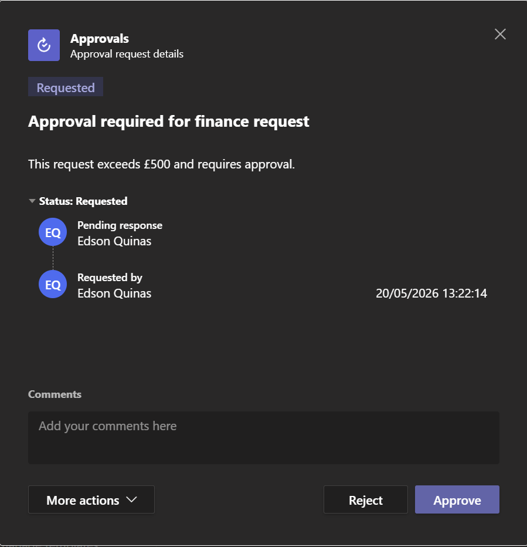
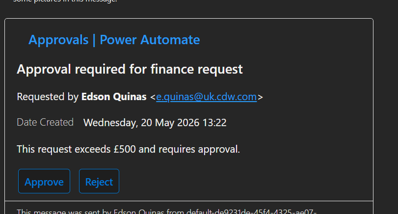

# ⚙️ Project: Finance Approval Workflow Automation

## 🎯 Objective
Design and implement an automated finance approval workflow that reduces manual decision-making, enforces approval rules, and ensures full traceability of all requests.

---

## 🧩 Architecture Diagram

---

## 🛠️ Architecture & Execution

• Created a manual trigger form capturing:
  - Requester Name  
  - Amount  
  - Description  

• Implemented threshold-based decision logic:
  - Requests below £500 are automatically approved  
  - Requests above £500 are routed for manual approval  

• Built a conditional workflow using Power Automate:
  - Automated branch for low-value requests  
  - Approval branch for higher-value requests  

• Integrated an approval system:
  - "Start and wait for approval" action  
  - Approve / Reject decision flow  

• Configured response handling:
  - Conditional logic to process approval outcome  
  - Separate workflows for approved and rejected requests  

• Implemented automated notifications:
  - Email confirmation for auto-approved requests  
  - Email notifications for approved and rejected outcomes  

• Added structured logging for auditability:
  - Captured requester, amount, outcome, and timestamp  
  - Ensured traceability of all decisions  

---

## 📸 Proof of Execution

### ✅ Phase 1: Auto Approval (Below Threshold)

---

### ✅ Phase 2: Approval Request Triggered

---

### ✅ Phase 3: Request Rejected

---

## 📊 Business Impact

• Reduced manual effort for low-value financial requests  
• Ensured consistent decision-making through rule-based automation  
• Introduced auditability and traceability into approval processes  
• Created a scalable workflow pattern for finance operations  

---

## ✅ Key Takeaways

• Demonstrated end-to-end workflow automation using Power Automate  
• Applied business rules to control financial decision-making  
• Implemented human-in-the-loop approvals for governance  
• Designed structured logging for compliance and auditing  
• Built a reusable pattern for future automation projects  
``
