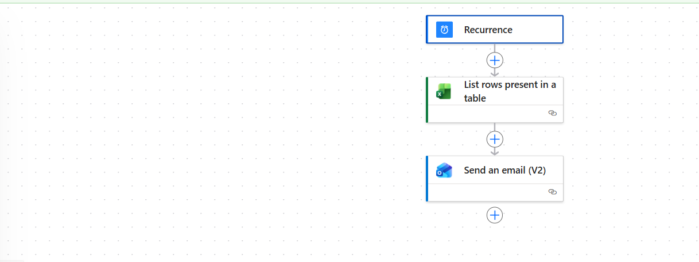
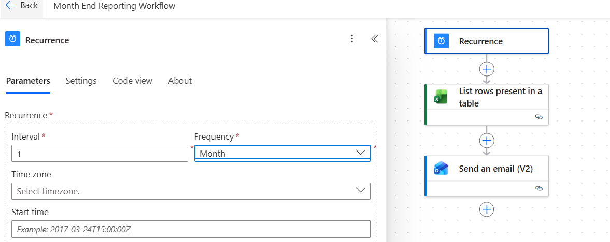
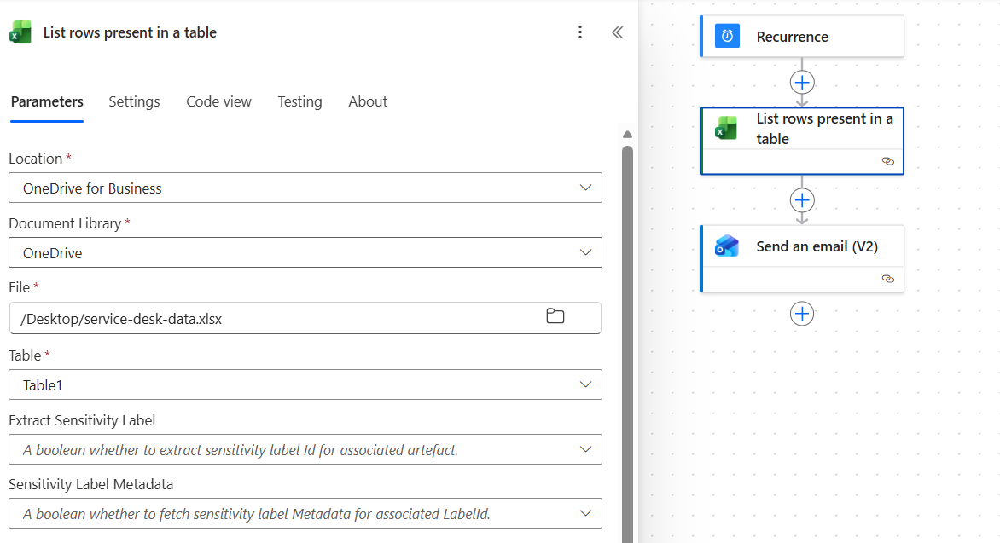
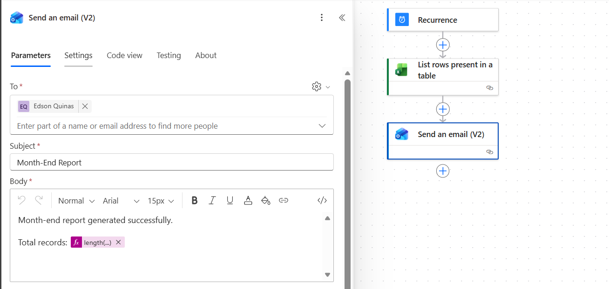

# 📊 Project: Month-End Reporting Automation

## 🎯 Objective
Design and implement a scheduled workflow to automate month-end reporting, reducing manual effort and ensuring consistent delivery of summary information to stakeholders.

---

## 🧩 Workflow Overview

---

## 🛠️ Architecture & Execution

• Created a scheduled flow using Power Automate:
  - Recurrence trigger configured to run monthly  

• Integrated Excel as a data source:
  - Connected to a structured dataset stored in OneDrive  
  - Used "List rows present in a table" to extract data  

• Processed data dynamically:
  - Counted total records using expressions  
  - Demonstrated data handling within the workflow  

• Implemented automated reporting:
  - Sent summary email to stakeholders  
  - Included dynamic data (record count) in the report  

• Ensured reliability of execution:
  - Tested multiple runs  
  - Verified correct data retrieval and output  

---

## 📸 Proof of Execution

### ✅ Scheduled Trigger

---

### ✅ Data Retrieval from Excel

---

### ✅ Automated Email Output

---

## 📊 Business Impact

• Reduces manual effort in recurring reporting tasks  
• Ensures consistent delivery of month-end summaries  
• Improves visibility of operational data  
• Provides a scalable foundation for finance reporting automation  

---

## ✅ Key Takeaways

• Demonstrated ability to automate scheduled processes  
• Integrated data sources into automated workflows  
• Applied dynamic expressions to generate meaningful outputs  
• Built a reusable pattern for reporting automation  

